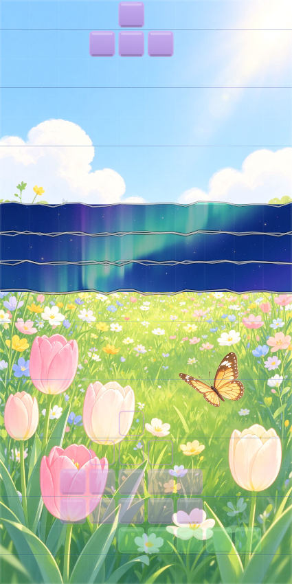

# TearTris · 撕纸俄罗斯方块

一个为 **DeepSeek Harness（DSH）** 做的摸鱼小游戏插件，也是独立的 HTML5 游戏。

> **核心玩法：双层图 + 消行撕纸。** 棋盘背景是两张叠在一起的图片——上层图 A 盖着下层图 B。
> 每消除一行，就把那一行的上层图「撕开」，露出下层图，两张图拼在一起，越玩越像一张新画。



## 效果演示

- 开局：整块棋盘显示**上层图 A**（默认示例：白天花园），棋盘本身完全透明，方块半透明，背景透出。
- 消行：被消除的每一行，上层图该位置**永久消失**，露出**下层图 B**（默认示例：星空极光）的对应位置，带锯齿撕边和撕纸动画。
- 终局：20 行全部撕开后，整张棋盘完全变成下层图 B 的画面。
- 可以换成任意两张你自己的图片（见下文「自定义图片」）。

## 安装（DSH 插件）

```bash
# 从 GitHub 安装（推荐 pin 一个 release tag，格式与生态一致）
dsh plugin --profile web add github:tuifeibenfeifei/teartris#v1.0.4

# 硬刷新浏览器（Ctrl/Cmd+Shift+R）后，右下角出现「T」悬浮按钮
# 点击按钮打开游戏面板，也可以直接访问 http://<dsh-host>:<port>/teartris/
```

> 首次安装若被 pnpm 拦截构建脚本，先在 `~/.dsh/profiles/web` 执行 `pnpm approve-builds --all` 再重试。

## 直接玩（无需 DSH）

把本仓库克隆下来（或只下载 `index.html` 和 `assets/`），**双击 `index.html`** 即可在浏览器里游玩，无需任何依赖。

> 想看 AI 自动演示撕纸效果？打开 `index.html?demo` —— 内置贪心 AI 会主动消行，逐层撕开上层图。

## 自定义图片

游戏支持把任意两张图片作为上/下层背景：

- **按钮**：右侧面板「选择 上层图 A」/「选择 下层图 B」。
- **拖拽**：直接把图片拖到棋盘上，左半边放上层 A，右半边放下层 B；一次拖入两张则自动分配。
- 自定义图片保存在浏览器本地（IndexedDB），下次打开仍在；点「重置为示例图」恢复默认。
- 图片会被等比裁切铺满棋盘（cover 模式），任何比例的图片都能用。

## 操作

| 按键 | 功能 |
| --- | --- |
| `←` / `→` | 左右移动 |
| `↑` / `X` | 顺时针旋转（SRS 踢墙） |
| `Z` | 逆时针旋转 |
| `↓` | 软降 |
| `空格` | 硬降 |
| `C` | 暂存（Hold） |
| `P` | 暂停 |
| `R` | 重新开始 |
| `M` | 音效开关 |

移动端有触屏按钮。计分规则：1/2/3/4 行 = 100/300/500/800 × 等级，连击有加成，软降 +1/格、硬降 +2/格。

## 目录结构

```
teartris/
├── index.html            # 游戏本体（单文件，内联 CSS/JS，可独立游玩）
├── assets/
│   ├── imageA.jpg        # 上层示例图（白天花园）
│   └── imageB.jpg        # 下层示例图（星空极光）
├── lib/
│   ├── index.js          # DSH 插件 Node 半部：挂 /teartris 路由，静态提供游戏
│   └── client.js         # DSH 插件客户端半部：右下角悬浮按钮 + 游戏面板（纯 DOM）
├── package.json          # DSH 插件包清单（cordis 插件格式）
├── dsh.plugin.json       # DSH 插件声明
├── cordis.patch.yml      # DSH profile layer 注入补丁
├── screenshot.png        # 效果截图
├── README.md
└── LICENSE               # MIT
```

## 技术要点

- 双层背景渲染：下层图整幅铺底，上层图按 20 个行带逐条绘制；已消除的行带跳过，露出下层图。
- 撕纸效果：每条撕开边界预生成确定性锯齿（按行带哈希的伪随机），消除瞬间有「揭起 + 纸屑 + 亮光」动画。
- 标准俄罗斯方块：7-Bag 随机、SRS 踢墙、幽灵块、Hold、Next×3、连击计分、等级加速。
- 零依赖：无 npm 运行时依赖，页面在 `file://` 与 DSH 路由两种环境下均可运行。

## 兼容性

- DSH：`>= 0.0.1`（web profile）。
- 浏览器：Chrome / Edge / Firefox 现代版本（使用 Canvas 2D、IndexedDB、Web Audio）。

## License

MIT © 2026
